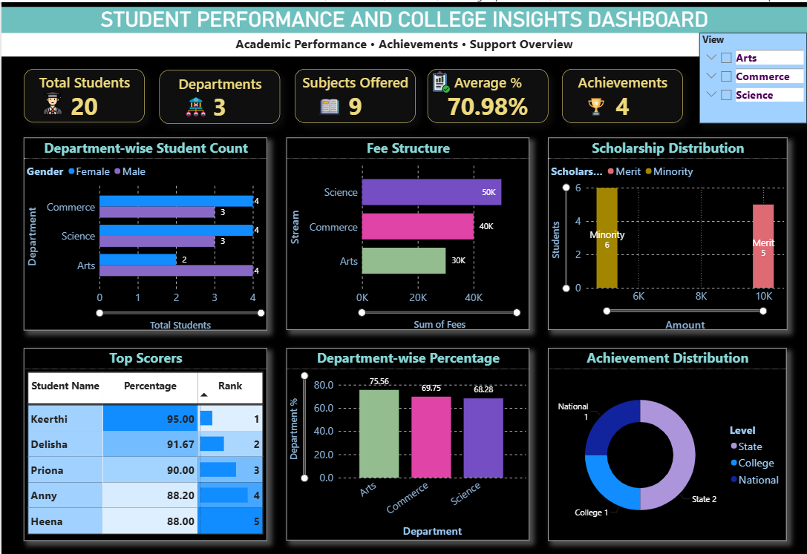
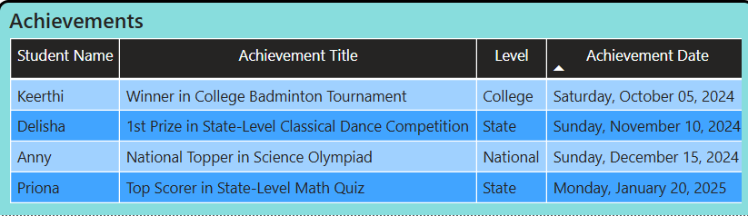

# 🎓 College Management SQL Project

A comprehensive SQL-based project simulating a real-world college management system. It covers student records, departmental subjects, performance analysis, scholarship decisions, and promotion logic. Designed to demonstrate advanced SQL capabilities and Power BI integration.

---

## 📌 Objective

To showcase how structured SQL operations can automate and analyze academic data for better decision-making in an educational institution.

---

## 🛠️ Tech Stack

- **Database**: MySQL  
- **Languages/Tools**: SQL  
- **Visualization**: Power BI 

---

## 📁 Project Structure

student-database-sql-project/
│
├── Full.sql # Complete SQL script (schema + data + queries)
├── Student_database_schema.sql # Table creation code
├── Sample_inserted_values.sql # Sample INSERT statements
├── Queries.sql # Analysis and reporting queries
├── README.md # Project documentation
└── College Management Dashboard.pbit #Power BI visuals 

yaml
Copy
Edit

---

## 🧠 Database Highlights

👨‍🎓 20 Students  
🏛️ 3 Departments: Arts, Commerce, Science  
📚 Multiple Subjects per Department  
📝 500+ Marks Records across subjects  
🏆 Achievements across Academics, Sports, Culture  
🧾 Scholarship Logic based on marks & minority category  
📅 Attendance Tracking influencing final promotion  

---

## 🧱 Database Modules

### 1. Student Admissions
Stores student profiles, department info, and category details.

### 2. Scholarships
Merit- and minority-based logic using SQL `CASE` and `WHERE` clauses.

### 3. Marks & Performance
Subject-wise marks and pass/fail records using aggregate queries.

### 4. Achievements
Results achievements across Academics, Sports, and Cultural activities — recorded at college, state, and national levels.

### 5. Promotions
Automated promotion decisions using academic performance and attendance criteria.

---

## 🔍 Key SQL Features Used

- `JOINs`  
- `GROUP BY`, `ORDER BY`, `HAVING`  
- `CASE`, `IF`, `ALIAS`  
- `Subqueries`  
- `CTEs`  
- `Window Functions`  
- `UNION`, `LIMIT`

---

## 🔮 Power BI Dashboard

Power BI visualizations:

-🎯 Department-wise Performance Dashboards → KPIs such as Total Students, Number of Departments, Overall Percentage

-🧾 Fee Structure & Scholarship Distribution Reports → Insights into financial aid and fee collections

-📈 Top Scorers of the College → Highlighting academic excellence

-📊 Student Achievements → State and National level recognitions showcased through interactive tooltips

---
## 📸 Dashboard Screenshots

1️⃣ College Management Dashboard 

2️⃣ Achievement Tooltip 

## ✅ How to Use

1. Open any MySQL-compatible client (MySQL Workbench).
2. Run `Full.sql` to create tables and populate data.
3. Use `Queries.sql` to explore reports, filters, and analytics.

---

## 🧑‍🎓 Author

**Priya Dsouza**  
Former Mathematics Lecturer | Data Analyst  
🔍 Actively seeking full-time opportunities | Immediate Joiner  
📫 [LinkedIn](https://www.linkedin.com/priya-dsouza-3a50a8257/) | 💻 [GitHub](https://github.com/priyadsouza-data

---

⭐ If you found this helpful, don’t forget to **Star** this repo!

